# Homework5
## Motion Parallax

### Input images:

|||
| ------------- | ------------- |
| 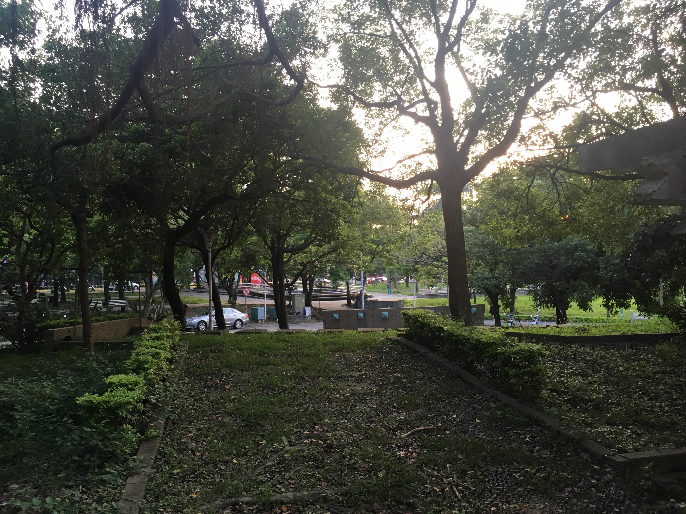  | 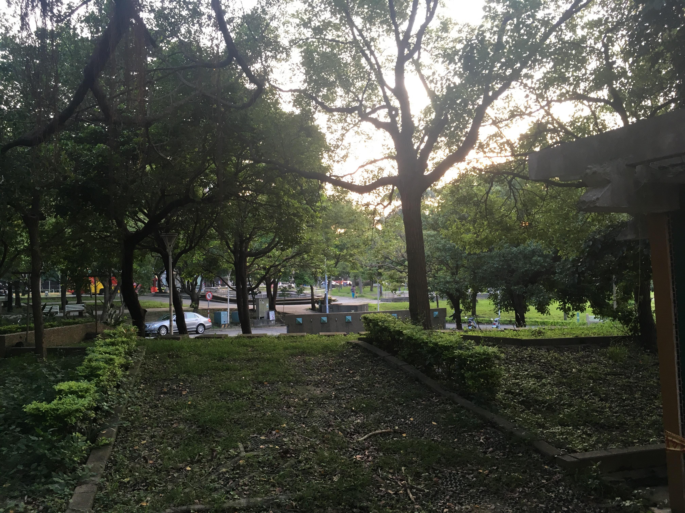  |

### Method:

1. Inputs為一左一右距離相近方向一致的圖片
2. 使用ORB找到features和matches之後，只留下距離最近的matches
3. 找homography，做perspective transformation，將兩張圖align在一起

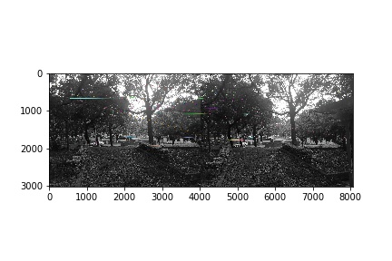

### Result: 

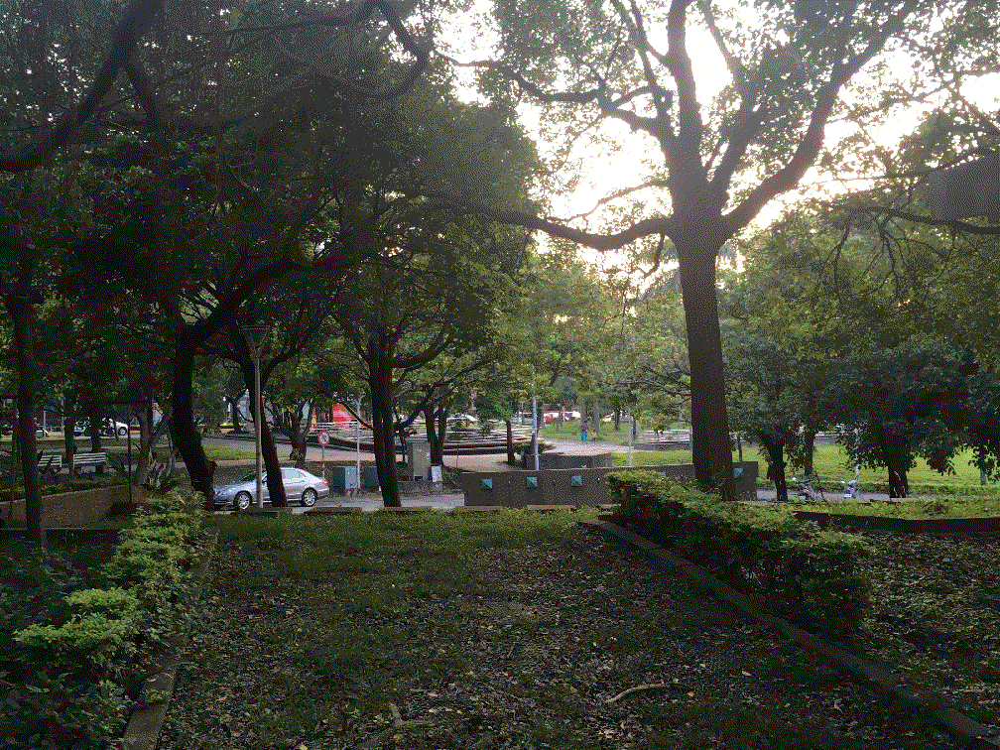

## Stop Motion

### Input images:

|||||
|-|-|-|-|
|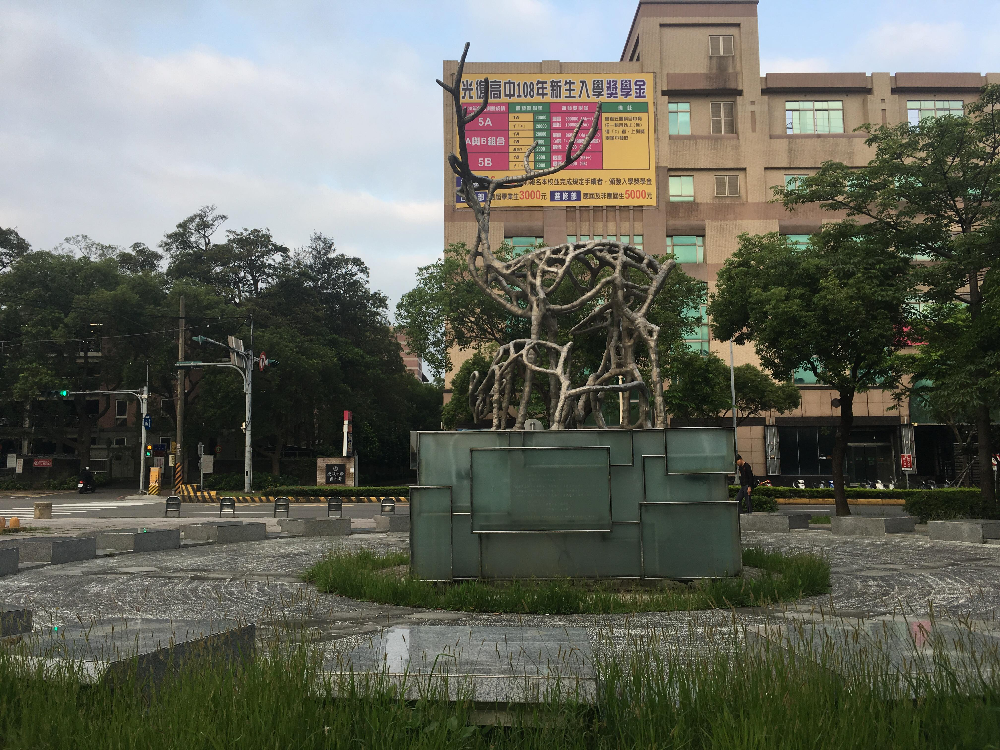|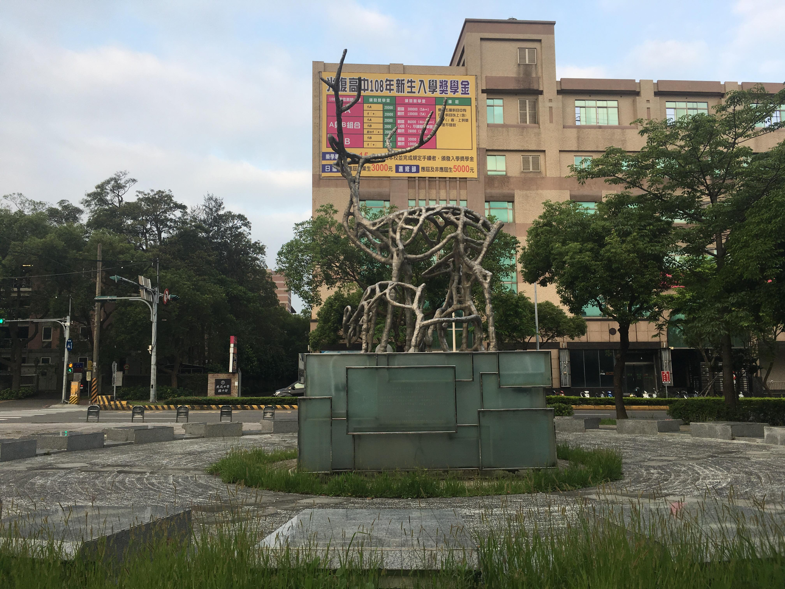|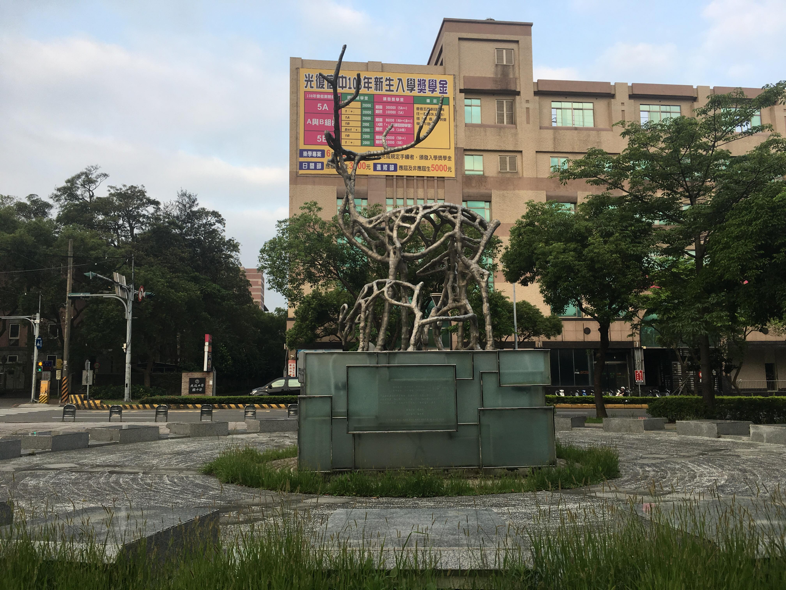|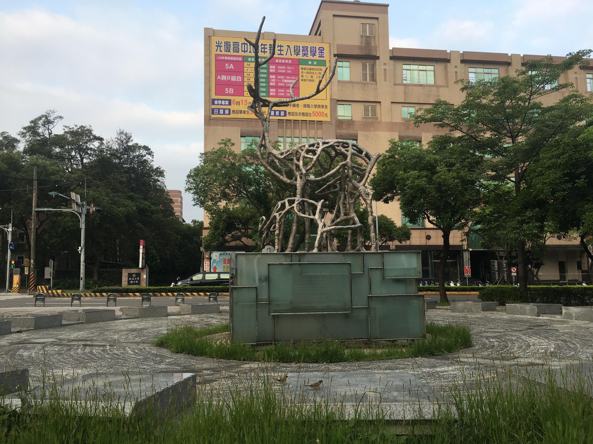|
|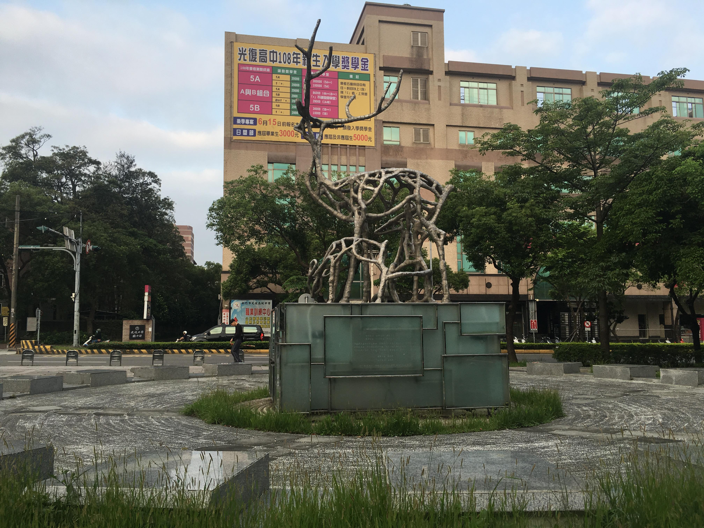|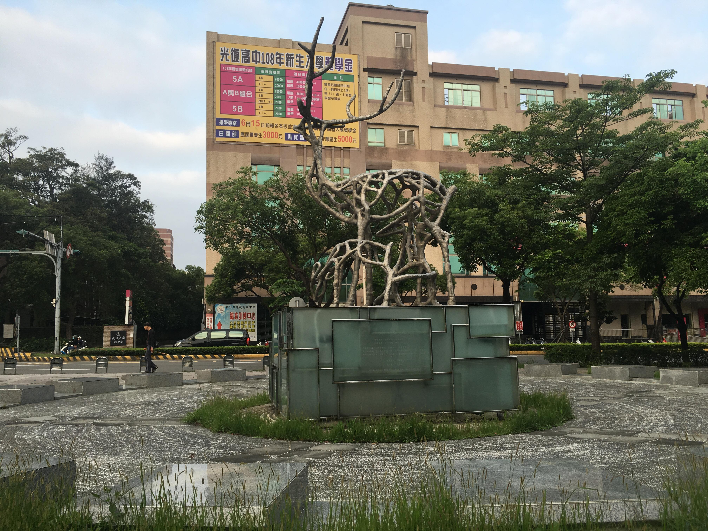|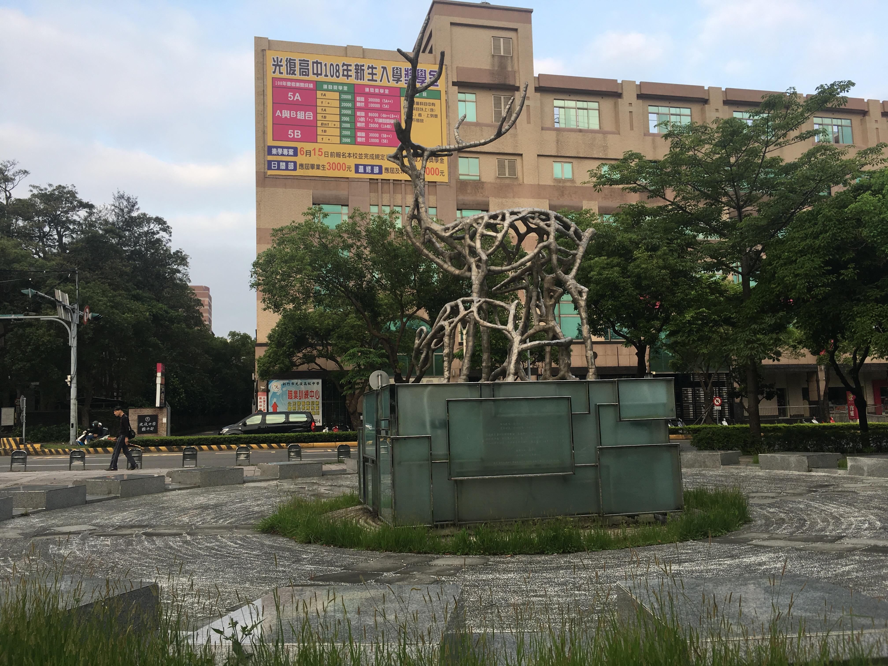|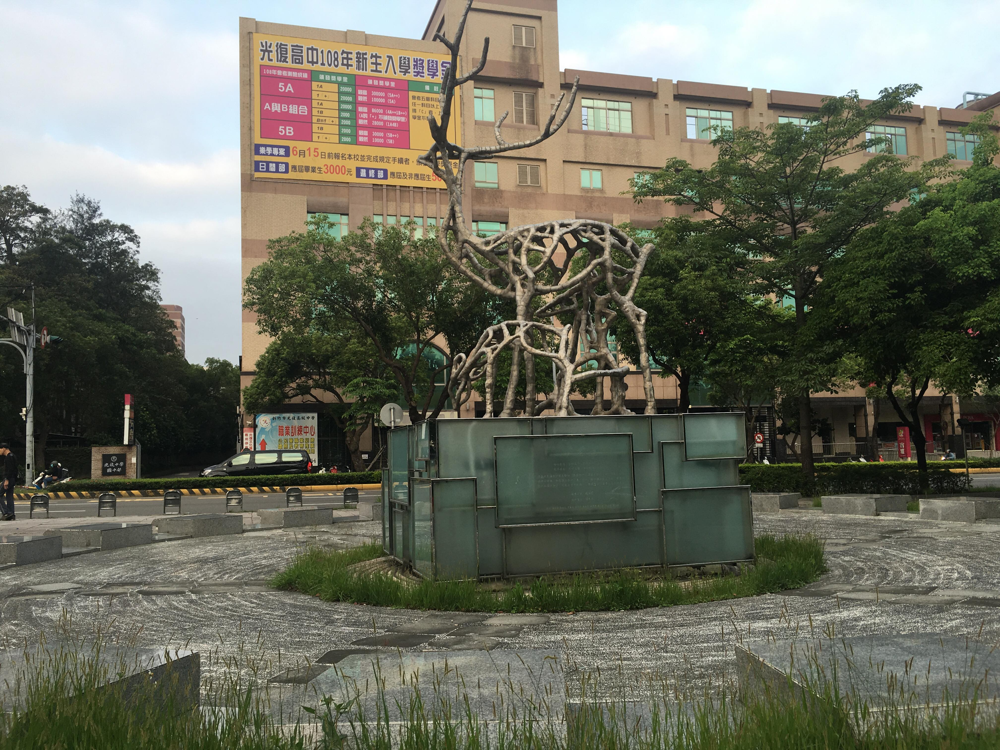|

### Method:

1. 拍一連串連續圖片作為inputs
2. 手動框出目標物
3. 使用ORB找到features和matches
4. 去掉背景的matches，僅留下目標物上的matches
5. 算出rigid transformation並套用
6. 使用這次算出的圖片與下一張進行以上3~5步

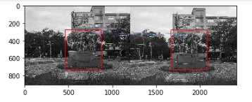

### Result: 

### Discussion: 

#### 限制Matches在目標物上

找出目標物並只使用目標物上的matches進行transform是很重要的。通常的情況下，背景的matches站大多數，因此會根據背景旋轉，造成目標移出範圍。所用的圖片雖然很接近stereo但實際上還是有差，直接套用opencv算stereo深度會失敗。手動限縮matches範圍為簡單且能讓穩定性有一定程度提升的辦法，但仍然容易在多張圖之後出錯。

但如果背景較為單純，則不限縮matches的範圍也是可以的

#### 使用Rigid Transformation

這裡使用rigid transformation而非perspective transformation的原因，是因為perspective transformation會將圖片變形，改變圖片所在的平面，使一開始的正面仍然是正面，而不會有我們想要的鏡頭移動的效果。下圖為使用perspective transformation的結果:

#### 拍攝良好的圖片

拍攝良好的input圖片是非常重要的，由於feature matching對於移動造成的變形並不是很robust，每個圖片之間要夠接近才能穩定且持續地找到正確的matches。根據經驗，每張圖片間隔約1~2步為佳。

